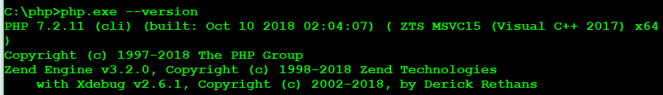
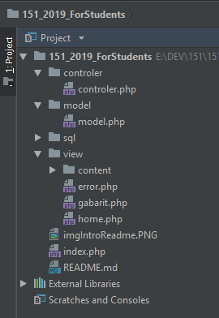
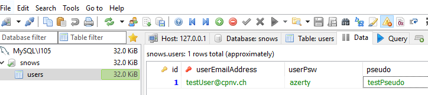

# RentASnow

RentASnow - ICT151 : application web de location de snowboards.


## Comment débuter ?

Récupérez le code de départ en clonant le dépôt directement dans PhpStorm. Vous obtiendrez :
  * La structure MVC (vide).
  * Le template (voir dans le répertoire [Projet]/view/content).
  
Modifiez "origin" afin de pouvoir connecter le code sur votre propre dépôt git en ligne. Modifiez l'origine ainsi:
  
  * En ligne de commande :

    1) Affichez les "remotes" présents:
          ```
          git remote -V
          ```

    2) Supprimer les "origines"
          ```
          git remote origin
          ```

    3)  Ajouter la référence de votre propre dépôt
          ```
          git remote add origin [le lien de votre dépôt]
          ```

  * Via PhpStrom [video]

      (https://www.jetbrains.com/help/phpstorm/set-up-a-git-repository.html)


### Pré-requis

* PhpStorm version 2018 ou ultérieure installée
  
* Configuration Php 7
  
  1) Xdebug (Aide : [PHP]/ext/xdebug.dll + config dans le php.ini)
  
  2) PDO (Aide : php.ini - extension=php_pdo_mysql.dll doit être décommentée)

      

* [Xdebug Helper](https://www.jetbrains.com/help/phpstorm/browser-debugging-extensions.html) intégré dans le navigateur de votre choix
  
* [Selenium IDE](https://www.seleniumhq.org/selenium-ide/) pour l'automatisation des tests au niveau de l'IHM (Aide : [tuto](https://www.youtube.com/watch?v=G9i3TYRxnY4))

### Mise en place
#### Code
Configurez PhpStorm ainsi:

   1. L'interpréteur Php doit être référencé pour que PhpStrom puisse l'appeler
   
   2. Le Web Server comme le Built-In-Server doivent être alignés (port d'écoute)

#### Base de données
Note : Vous trouverez le script de base de données dans le répertoire [Projet]/sql/snowScriptStart.sql.

   1. Connectez vous en tant que dba sur votre moteur de base de données et créer la base de données à l'aide du script livré.
   
   2. Créez un utilisateur qui sera le lien entre votre application web et votre base de données.
   
      *  Droits limités suivants : SELECT, INSERT, UPDATE.
   
      *  Accès uniquement la base de données "snows".
  

#### Résultat attendu
Dans PhpStrom



Dans la base de données

